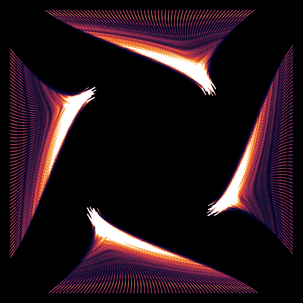
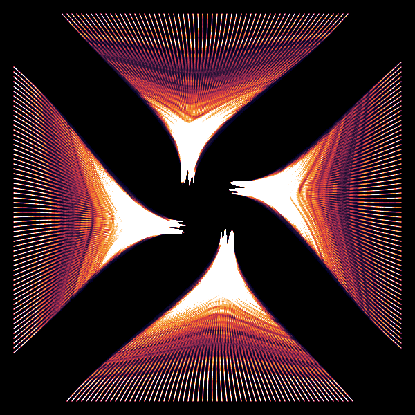
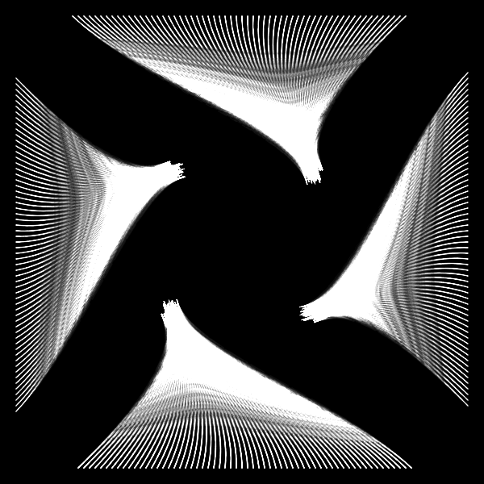

# Output Catalog

Generated artworks organized by project, name, and date.

---

## Attractor

| # | Preview | File | Palette | Date | Notes |
|---|---------|------|---------|------|-------|
| 1 |  | `attractor-neon-1778729707122.png` | Neon | 2026-05-13 | Open composition, divergent curves |
| 2 |  | `attractor-neon-1778729737123.png` | Neon | 2026-05-13 | Centered offset, convergent X shape |
| 3 |  | `attractor-mono-1778729752247.png` | Mono | 2026-05-13 | Monochrome variant, high contrast |

---

> **Tip:** Use descriptive filenames, e.g. `attractor-neon-seed42.png`
